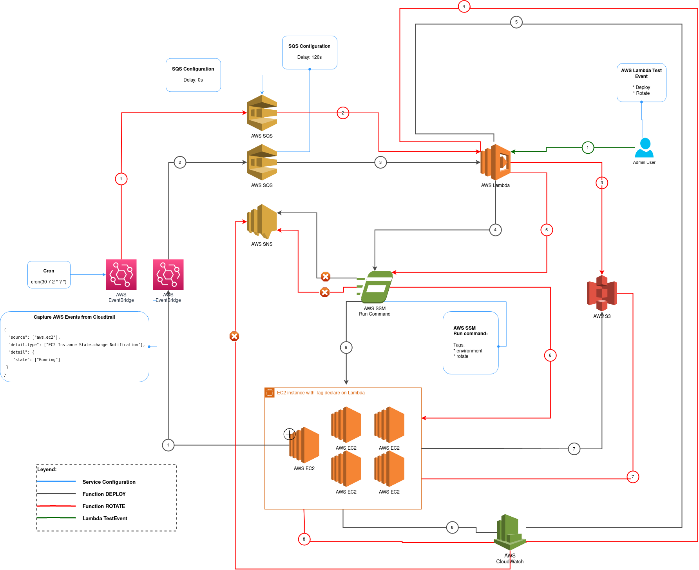

# aws-ssh-key-lambda-rotation
---
AWS does not allow to modify the SSH key of EC2 instances, the option they suggest is to recreate the instance with the new key.

This repository provides an automated alternative for SSH key rotation with AWS services.

## Diagram
---


## How to use it
---
* Modify the backend where the tfstate will be stored, in the terraform_config.tf file.
* Modify the region where our code will be deployed, in the terraform_config.tf file.
* Package the libraries to use the script in Lambda and upload the .zip file to the S3 bucket `s3://<bucket-name>/dependencies/`

```bash
$ virtualenv venv
$ source venv/bin/activate
$ pip install -r src/requirements.txt
$ zip -r libs.zip venv/lib/python/site-packages/*
```
